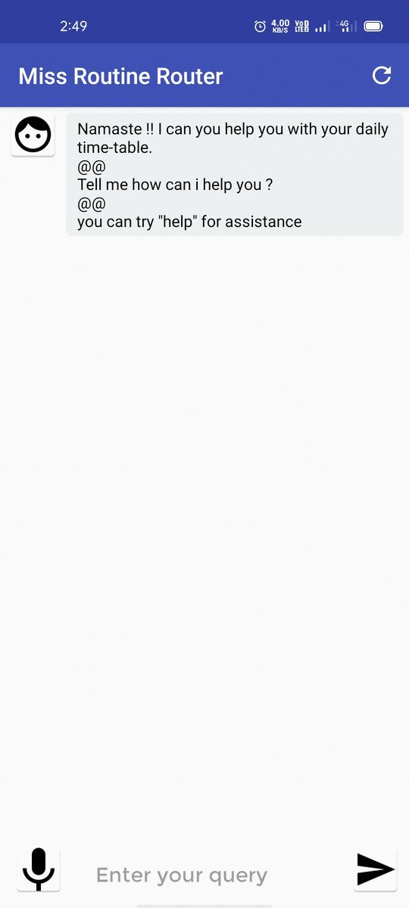

```
Project Title :  “An Android Chatbot Application That Uses Watson Chatbot Assistant & Cloud Function That Can Provide Class Time-Tables to a User” 
```
```
This minor project is Submitted in partial fulfilment of the requirements for the award of Bachelor of Technology (B.Tech) In the department of Computer Science & Engineering of Kaziranga University.
```
Try our app : https://drive.google.com/file/d/1GBuo6C7-V2HhookvVOGN-Kug5U33PWh9/view?usp=sharing


```
"watson-chatbot-JSONfile.json" is our designed chatbot, extracted directly from the IBM Watson Assistant. 
```
```
"get_routine_cloud_function.js" is the level2 node.js file of our chatbot. it is implemented in IBM Cloud Function. 
```

```
Group Members : 
1.Ritom Puzari (Leader)
2.Eyotsono Neikha 
3.Aditya Singh 
4.Geerija chakraborty 
5.Vikesenuo Tase
```
